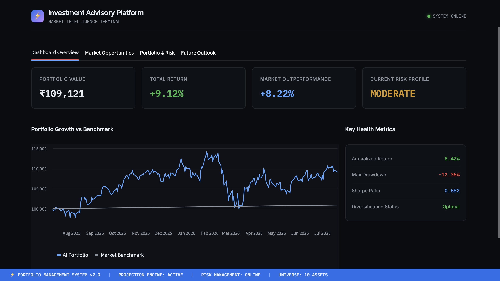
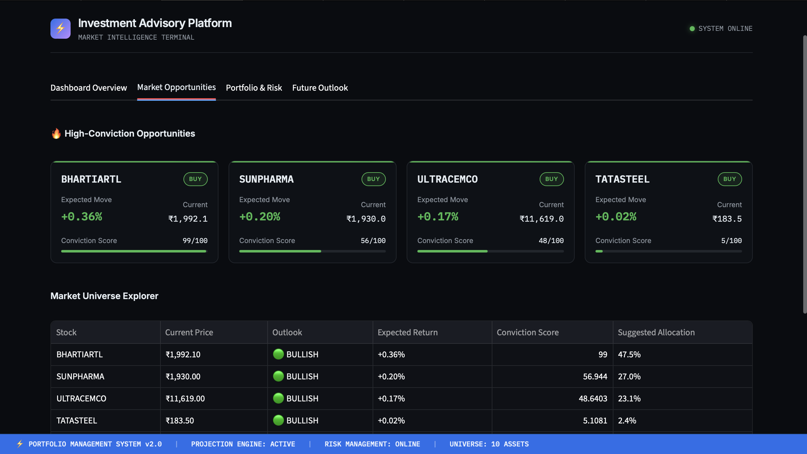
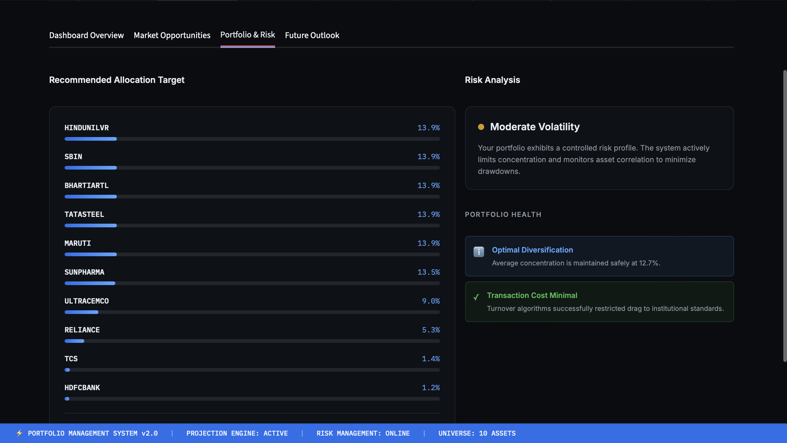
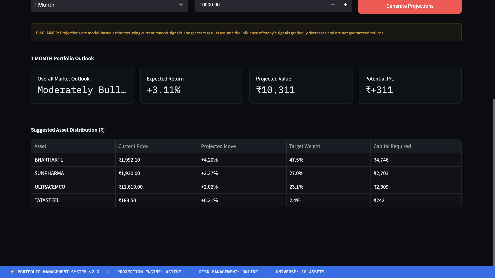
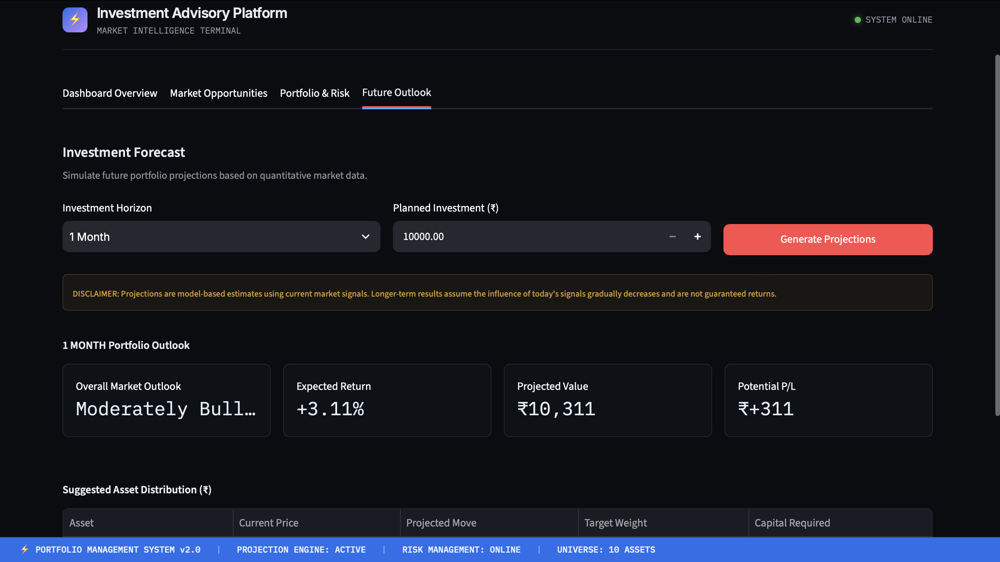

# TradeAlpha: Reinforcement learning & ML Powered Stock Market Forecasting & Portfolio Optimization

[](https://tradealpha-kf7flfuhbsbwdokmrtzvdm.streamlit.app/)
[](https://www.python.org/)
[](https://xgboost.readthedocs.io/)
[](https://stable-baselines3.readthedocs.io/)
[](https://streamlit.io/)

**Live Application:**  
https://tradealpha-kf7flfuhbsbwdokmrtzvdm.streamlit.app/

TradeAlpha is a hybrid AI platform that combines **XGBoost-based stock return forecasting** with **PPO reinforcement learning** for risk-aware portfolio optimization.

The system transforms financial market data into predictive signals, portfolio allocation decisions, risk analysis, performance evaluation, and interactive future investment projections through a Streamlit application.

> A hybrid AI approach combining supervised market forecasting with reinforcement learning for adaptive portfolio decision-making.

---

## Dashboard

### Investor Dashboard



### Market Opportunities



### Optimized Portfolio



### Personalized Asset Distribution



### User Investment Input



---

## Architecture

```text
Market Data
     |
     v
Data Preprocessing
     |
     v
Feature Engineering
     |
     v
XGBoost Return Forecasting
     |
     v
Predicted Stock Returns
     |
     v
PPO Reinforcement Learning
     |
     v
Risk-Aware Portfolio Allocation
     |
     +-----------------------------+
     |             |               |
     v             v               v
   Risk      Concentration    Transaction
 Control        Control           Costs
     |             |               |
     +-------------+---------------+
                   |
                   v
          Portfolio Evaluation
                   |
          +--------+--------+
          |                 |
          v                 v
     Performance       Future Outlook
      Analytics          Projections
          |                 |
          +--------+--------+
                   |
                   v
          Interactive Dashboard
```

##Key Results

Metric	PPO V4	Equal Weight
Total Return	9.12%	0.90%
Annualized Return	8.42%	0.83%
Sharpe Ratio	0.682	0.129
Volatility	13.13%	12.82%
Maximum Drawdown	-12.36%	-13.62%
Win Rate	51.10%	50.00%
Final Portfolio Value	₹109,120.82	₹100,901.28

Excess Return: +8.22 percentage points

Starting capital: ₹100,000

Final PPO V4 portfolio value: ₹109,120.82

XGBoost Forecasting

The forecasting layer uses XGBoost to predict short-term stock returns from engineered financial time-series features.

Features include:

Historical returns
Moving averages
Momentum
Volatility
Price relationships
Trading volume indicators
Price range statistics

Forecasting evaluation:

18,200 observations
10 stocks
62.07% directional accuracy
0.5972 prediction/actual correlation
0.010641 MAE
0.014659 RMSE

The forecasting layer produces:

Predicted Return
Predicted Price
Predicted Direction
PPO Portfolio Optimization

PPO is used as the portfolio decision-making layer.

A custom Gymnasium environment was developed with:

10 tradable assets
20-dimensional observation space
10-dimensional continuous action space
Dynamic portfolio weights
Portfolio risk calculation
Concentration control
Transaction-cost modeling
Forecast-signal alignment

The reward function incorporates multiple objectives:

Reward
=
Net Portfolio Return
- Risk Penalty
- Concentration Penalty
+ Forecast Signal Alignment
PPO V4 Improvement

The initial PPO strategy produced a -2.04% return during evaluation.

PPO V4 introduced alignment between the XGBoost forecast signals and the reinforcement-learning portfolio policy while retaining risk and concentration controls.

Result
PPO V3 Return     : -2.04%
PPO V4 Return     :  9.12%

This resulted in an 11.16 percentage-point improvement over the initial PPO strategy and an 8.22 percentage-point advantage over the equal-weight benchmark.

Future Investment Outlook

TradeAlpha provides model-derived projections across multiple investment horizons:

1 Day
1 Week
1 Month
1 Year

Users can enter an investment amount and explore:

Expected return
Projected portfolio value
Potential profit or loss
Suggested asset allocation

Example using ₹100,000:

Horizon	Projected Return	Projected Value
1 Day	0.27%	₹100,266.84
1 Week	1.17%	₹101,173.18
1 Month	3.11%	₹103,105.12
1 Year	4.07%	₹104,071.81

The 1-day forecast is the direct next-day prediction. Longer horizons are model-derived projections using a decaying forecast signal.

Asset Universe

The current system evaluates 10 NSE-listed equities:

RELIANCE.NS
TCS.NS
HDFCBANK.NS
HINDUNILVR.NS
SBIN.NS
BHARTIARTL.NS
MARUTI.NS
SUNPHARMA.NS
TATASTEEL.NS
ULTRACEMCO.NS
Technology Stack

Languages and Frameworks

Python
Pandas
NumPy
Scikit-learn

Machine Learning

XGBoost

Reinforcement Learning

PPO
Stable-Baselines3
Gymnasium

Application

Streamlit

Visualization

Matplotlib

Project Structure
```
TradeAlpha/
|
├── dashboard.py
├── future_prediction_engine.py
├── future_prediction_ui.py
├── feature_engineering.py
├── generate_forecasts.py
├── train_forecaster.py
├── xgb_live_predict.py
├── trading_env_v4.py
├── train_ppo_v4.py
├── evaluate_ppo_v4.py
├── requirements.txt
|
├── models/
|
├── data/
|
└── assets/
    ├── Dashboard.png
    ├── market_opportunities.png
    ├── optimized_portfolio.png
    ├── personalized_Asset_distribution.png
    └── userdata_input.png
```

TradeAlpha is a research and academic project.

The forecasting model is trained on historical market behavior and cannot guarantee future performance. Longer-horizon projections are derived from current model signals rather than independently trained long-horizon forecasting models.

Backtested and simulated performance should not be interpreted as guaranteed live-market results.

Disclaimer

TradeAlpha is not financial advice.

All forecasts, portfolio allocations, and projected returns are model-generated estimates intended for research and demonstration purposes.
